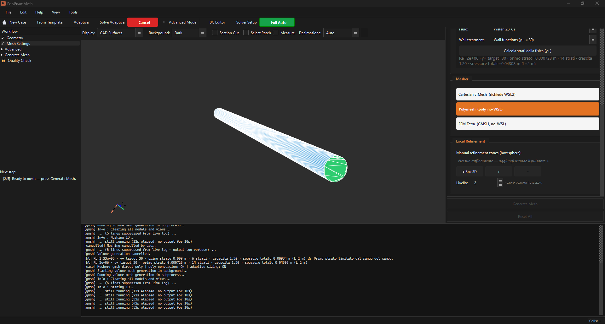
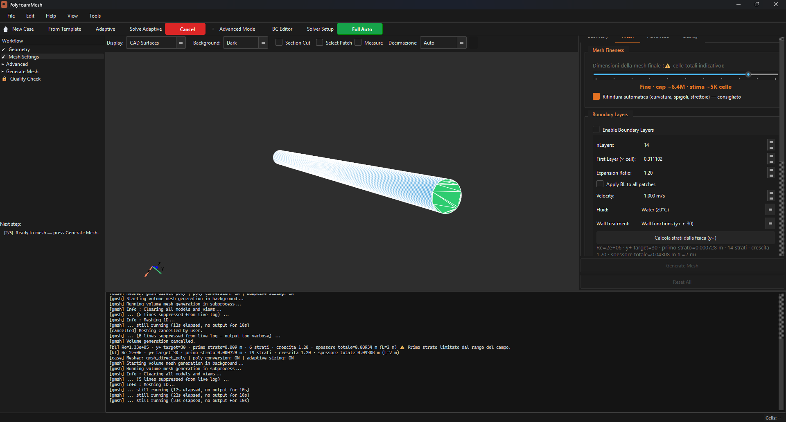
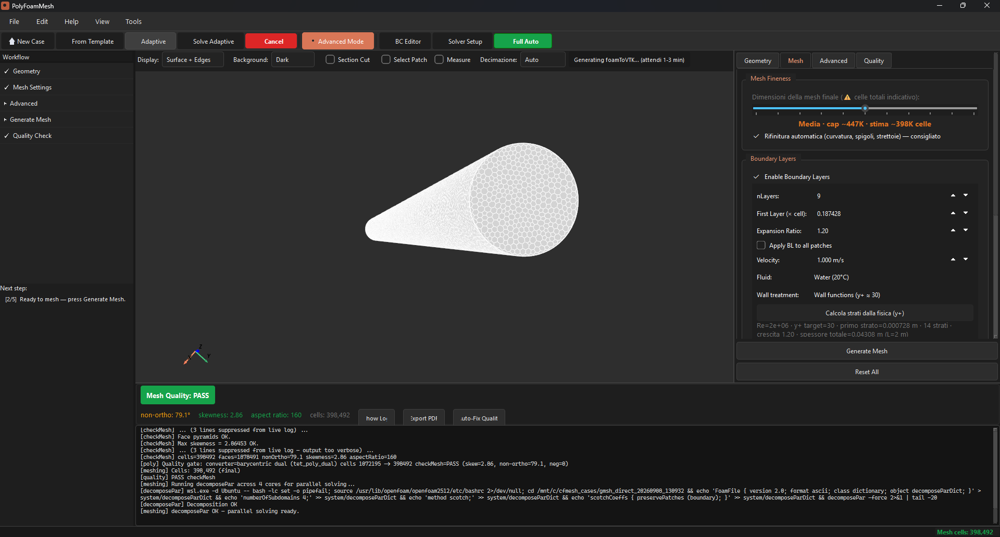
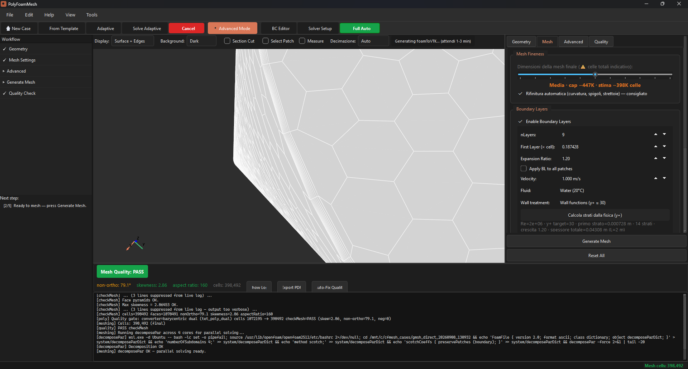

# PolyFoamMesh


*[Versione in italiano](README.it.md)*

Developed with a human-in-the-loop approach: the architecture and physics
decisions are the author's; AI assistance sped up the writing. Details in
[AI_COLLABORATION.md](AI_COLLABORATION.md).

Generates polyhedral meshes for OpenFOAM from a STEP or STL file, with
boundary layers, without hand-writing dictionaries. GMSH and cfMesh do the
raw meshing; on top of that sits a tet→poly converter built from scratch
(barycentric dual — the same topology that makes StarCCM+'s polyhedral
meshes what they are) and a boundary-layer engine that runs directly on
the polyhedral mesh, patch by patch.

License: [GPLv3](LICENSE) · [Third-party licenses](THIRD_PARTY_LICENSES.md) · [Contributing](CONTRIBUTING.md)

## Screenshots

The mesher choice and the boundary-layer engine — the two things this
project actually adds on top of raw GMSH/cfMesh — right in the main
window:

<p align="center">
  
  
</p>

*Left: pick the meshing strategy per case — Cartesian cfMesh (WSL2),
the native polyhedral mesher (no WSL needed), or plain tetrahedral for
FEM. Right: boundary-layer settings, with a y+-driven first-layer
thickness calculator.*

And the actual output — a 398K-cell polyhedral mesh with 9 boundary layers,
`checkMesh` passing (skewness 2.86, non-ortho 79.1°):

<p align="center">
  
  
</p>

## Why not just use cfMesh directly

cfMesh and GMSH produce raw meshes — hex or tet — and anyone working with
OpenFOAM already has that. The part that was missing, and that this
project adds, comes after:

- a **tet→poly barycentric-dual converter**, written for this project (not
  a cfMesh feature): takes GMSH's tet mesh and turns it into a fully
  polyhedral mesh;
- a **boundary-layer engine that runs on the polyhedral mesh itself**, also
  built from scratch (pure numpy): it extrudes prisms on whichever patches
  you choose, not blindly across the whole domain — I'm not aware of
  another open-source tool in the OpenFOAM ecosystem that does this with
  this level of control inside a GUI;
- a quality auto-fix loop (checkMesh → fix → re-mesh, up to 3 iterations)
  and a mechanism that switches meshing algorithm on its own if the chosen
  one doesn't reach the required quality.

Where this pipeline works well and where it doesn't (there are concave
geometries where the polyhedral dual doesn't close perfectly) is written
up without spin in [docs/residual_risks.md](docs/residual_risks.md).

## Who this is for

If you prepare OpenFOAM meshes by hand-writing `blockMeshDict`,
`snappyHexMeshDict` or `meshDict`, and only find out something's wrong
after running `checkMesh`, this app takes over most of that work: load the
geometry, generate the mesh with one click, watch the quality get computed,
export a case ready for the solver.

## How it compares

Against **plain snappyHexMesh**: same cost (free, both run on OpenFOAM),
but here the polyhedral mesh and the boundary layer are automatic instead
of a sequence of dictionaries you write by hand.

Against **Ansys Meshing, ANSA, Pointwise**: they're still more mature and
capable on genuinely complex geometry, and they cover more solvers — this
project only targets OpenFOAM. In exchange it's free and open source, and
the polyhedral mesh (usually a commercially-licensed feature) costs
nothing here.

This isn't a replacement for a mature commercial tool on hard geometry —
it's for people working with OpenFOAM who want polyhedral meshing without
paying for a license to get it.

## User documentation

- **[Installation](docs/INSTALL.md)** — Windows installer or from source
- **[User guide](docs/USER_GUIDE.md)** — how the workflow works, tab by tab
- **[Known limitations](docs/residual_risks.md)** — what doesn't work yet, and why

## Architecture

```
┌───────────────────────────────────────────────────────────┐
│                       GUI (PySide6)                       │
│  ┌───────────┐ ┌───────────┐ ┌───────────┐ ┌───────────┐  │
│  │  Geometry │ │    Mesh   │ │  Advanced │ │  Quality  │  │
│  │    Tab    │ │    Tab    │ │    Tab    │ │    Tab    │  │
│  └───────────┘ └───────────┘ └───────────┘ └───────────┘  │
│                                                           │
│            │          │          │          │             │
│            ▼          ▼          ▼          ▼             │
│  ┌───────────────────────────────────────────────────┐    │
│  │                 Core Engine Layer                 │    │
│  │   FeatureDetector   GMSH Wrapper   cfMesh Runner  │    │
│  │   meshDict Gen      Mesh Converter   Quality Fix  │    │
│  └───────────────────────────────────────────────────┘    │
│                                                           │
│             │              │               │              │
│             ▼              ▼               ▼              │
│  ┌──────────────┐ ┌──────────────┐ ┌──────────────┐       │
│  │     GMSH     │ │    cfMesh    │ │   OpenFOAM   │       │
│  │   (native)   │ │    (WSL2)    │ │checkMesh/... │       │
│  └──────────────┘ └──────────────┘ └──────────────┘       │
└───────────────────────────────────────────────────────────┘
```

## Key features

| Feature | Description |
|---------|-------------|
| **GMSH + cfMesh hybrid** | GMSH analyzes curvature/sizing, cfMesh fills the volume |
| **GMSH direct** | Full tet + boundary-layer mesh on Windows, no WSL needed |
| **Feature detection** | Automatic sharp edges, thin gaps, curvature analysis |
| **New Case wizard** | 3-step guided workflow (Geometry → Mesh → Quality) |
| **Quality pipeline** | checkMesh → auto-fix → re-run (up to 3 iterations) |
| **Quick Mesh (1-click)** | `Ctrl+M` for an instant mesh with auto-suggested parameters |
| **Export** | CGNS and VTU, for ParaView or other solvers |
| **Section cut / measure** | Interactive tools in the 3D viewer |
| **Undo/redo** | Full undo stack on mesh parameters |
| **Case templates** | Presets for internal flow, external aero, CHT |
| **PDF quality report** | Mesh quality report with charts, for documenting a case |
| **Plugin system** | Extend the app via `plugins/`, no core changes needed |
| **Italian localization** | UI, help and part of the docs also in Italian |

## Quick install

Requirements: Windows 10/11, Python 3.11+ (source install only), optionally
OpenFOAM v2512 in WSL2. Full guide (installer or from source):
**[docs/INSTALL.md](docs/INSTALL.md)**.

```bash
pip install -e ".[test]"
pip install gmsh meshio reportlab
polyfoammesh
```

Workflow and shortcuts: **[docs/USER_GUIDE.md](docs/USER_GUIDE.md)**.

## Project structure

```
PolyFoamMesh/
├── src/polyfoammesh/           # Python package
│   ├── app.py                  # Entry point (splash, theme, i18n)
│   ├── config.py               # OpenFOAM/WSL configuration
│   ├── core/                   # Engine layer (no GUI imports)
│   │   ├── geometry.py         # CAD import (cadquery, trimesh)
│   │   ├── gmsh_wrapper.py     # GMSH Python API wrapper
│   │   ├── meshdict_gen.py     # cfMesh meshDict generator
│   │   ├── feature_detector.py # Sharp edges, gaps, curvature
│   │   ├── openfoam_runner.py  # cfMesh runner + error analysis
│   │   └── …                   # workflow, session, validation, …
│   ├── commercial/             # Advanced meshing modules
│   │   ├── mesh_engine.py      # Multi-algorithm engine + escalation
│   │   ├── quality_engine.py   # Quality auto-fix loops
│   │   ├── adaptive_loop.py    # Solution-adaptive refinement
│   │   └── …                   # ~30 modules (boundary layers, mosaic, AMR, …)
│   ├── api/server.py           # Optional FastAPI headless server
│   └── gui/                    # PySide6 GUI (tabs, viewer, wizard, reports)
├── plugins/                    # Plugin system
├── templates/                  # Case presets (JSON)
├── locale/                     # i18n translations
├── installer/                  # NSIS / Inno Setup scripts
├── tests/                      # pytest suite (~1100 tests)
├── benchmarks/, tools/         # Benchmark and dev scripts
└── docs/                       # User docs (root) + internal dev notes (docs/dev/)
```

## Testing

```bash
# Full suite
pytest tests/ -v

# Fast subset (what CI and the pre-commit hook run — no slow/WSL tests)
pytest tests/ -m "not slow and not wsl" -q
```

### Pre-commit gate

The repo ships a `.pre-commit-config.yaml` that runs on every commit: ruff
(rules E9/F/B) on staged files, then the fast test subset. Install once
with:

```bash
python -m pre_commit install
```

Bypass in an emergency with `git commit --no-verify`.

## For maintainers

- **Rebuilding the exe/installer** (PyInstaller one-dir + Inno Setup):
  [docs/dev/DISTRIBUZIONE.md](docs/dev/DISTRIBUZIONE.md) (Italian)
- **Internal dev notes** (handoffs, mesher status, development log):
  [docs/dev/](docs/dev/) — not needed to use the app, useful only if
  you're touching the meshing engine itself

## Methodology

Development follows a human-in-the-loop workflow: the physical
algorithms, numerical tolerances, and error-handling strategy are
designed by the author; AI assistance is used for boilerplate (GUI, unit
tests, config templates, log parsers) under that direction, with every
line reviewed before merging. Full breakdown, including who wrote what:
[AI_COLLABORATION.md](AI_COLLABORATION.md).

The human author is fully responsible for the correctness and physical
validity of this code. AI was a supporting tool, not an autonomous author.

## License

GPLv3 — see [LICENSE](LICENSE) and [THIRD_PARTY_LICENSES.md](THIRD_PARTY_LICENSES.md).
